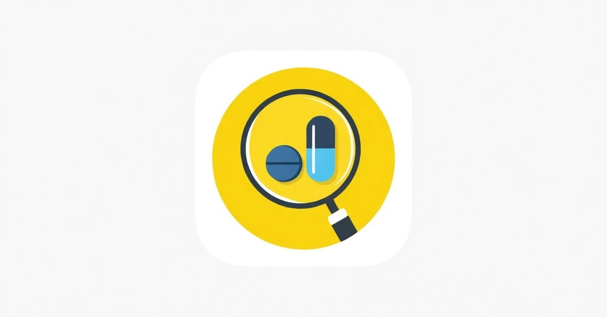

# Sistem Rekomendasi Obat
. 

## Penggunaan
### Local
- Install java
- Install python
- Install package python
```bash
python -m pip install -r requirements.txt
```
- Jalankan indexer
```bash
python preprocessing/build-index.py
```
- Jalankan webapp
```bash
FLASK_APP=web/app.py flask run --host=0.0.0.0
```

### Docker
- Membuat image
```bash
docker build -t drug-recommender:latest .
```

- Jalankan indexer
```bash
docker compose --profile indexing run --rm indexing
```

- Jalankan webapp
```bash
docker compose --profile webapp up webapp
```

## Task List

### 1. Setup Environment
- [x] Buat `Dockerfile` (Python + Java untuk Pyserini)
- [x] Buat `docker-compose.yml`
- [x] Buat `requirements.txt` (pyserini, scispacy, dll)

#### Output - container list:
- bash/coba-coba: `docker compose --profile dev run --rm base`
- indexing: `docker compose --profile indexing run --rm indexing`

### 2. Dataset
- [x] Skrip fetch PubMed (5 tahun terakhir)
- [x] Skrip preprocessing (cleaning, format JSONL)
- [x] Download/generate dataset

#### Output:
- Skrip pembuatan dataset di `preprocessing/dataset/preparedata.py`
- Dataset jadi di `preprocessing/dataset/processed/pubmed_2020_2025.jsonl`
- Dataset jadi diupload di `https://drive.google.com/file/d/1MPhn4gNCMapH-ddtw3jxzIZwpzLyTfex/view?usp=sharing`

### 3. Indexing (Pyserini)
- [x] Skrip build inverted index dari JSONL
- [x] Verifikasi index

#### Output:
- script indexing: `preprocessing/build-index.py`
- jalankan dengan docker `docker compose --profile indexing run --rm indexing`
- hasil index ditaruh di `indexes`
- script/langkah pembuat indexing dengan pyserini ditaruh di `preprocessing/build-index.py`

### 4. Information Retrieval
- [ ] Modul query expansion (tambah treatment/pharmacotherapy/drug/therapy)
- [ ] Modul search BM25 (top-K retrieval)

### 5. Ekstraksi Entitas (scispaCy)
- [ ] Modul ekstraksi nama obat
- [ ] Modul ekstraksi zat aktif/senyawa kimia
- [ ] Modul ekstraksi dosis (opsional)

### 6. Agregasi & Scoring
- [ ] Frequency scoring obat dari top-K dokumen
- [ ] Ranking rekomendasi

### 7. Evaluasi
- [ ] Siapkan 10 query penyakit (sesuai prevalensi PHC)
- [ ] Evaluasi IR: hitung P@10
- [ ] Evaluasi ekstraksi: hitung Entity Precision

### 8. UI / Output
- [ ] Tampilkan daftar rekomendasi obat
- [ ] Tampilkan cuplikan kalimat sumber + tautan jurnal
