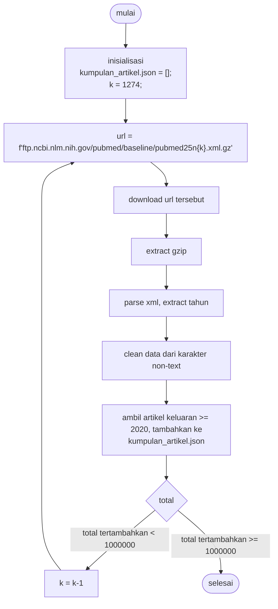
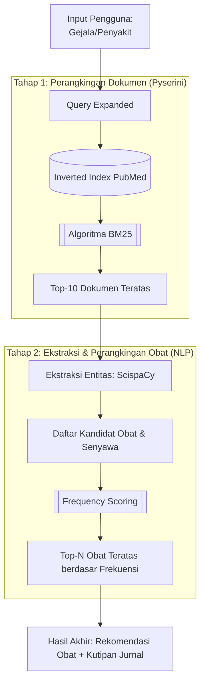

# Sistem Rekomendasi Obat
**24 Januari 2026**

- Dhea Anggita
- Muhammad Ramdan Izzulmakin
- Akbar Aryo Wicaksono
- Muhammad Aldo Ridhoni
- Mustofa Ardi Kurniawan
- I Putu Yosua Yerikho

**PROGRAM MAGISTER ILMU KOMPUTER**
**DEPARTEMEN ILMU KOMPUTER DAN ELEKTRONIKA**
**FAKULTAS MATEMATIKA DAN ILMU PENGETAHUAN ALAM**
**UNIVERSITAS GADJAH MADA**
**2026**

***

## Pendahuluan

### Latar Belakang
Ketika melakukan rekomendasi obat, tenaga medis harus memberi keputusan berdasarkan bukti ilmiah terbaru. Sementara itu, volume publikasi ilmiah di dunia medis senantiasa bertambah setiap tahunnya. Platform seperti PubMed menyimpan jutaan abstrak jurnal, namun tenaga medis seringkali kesulitan menemukan informasi spesifik mengenai efektivitas suatu obat di tengah tumpukan data yang masif tersebut. Pencarian manual memakan waktu yang lama, sementara kebutuhan terkait dengan keputusan medis seringkali bersifat mendesak. Selain itu risiko terjadi kesalahan informasi medis juga sangatlah tinggi jika mengandalkan mesin pencari umum. Oleh karena itu, pengembangan aplikasi sistem Information Retrieval (IR) yang terfokus untuk menyaring literatur ilmiah medis sangatlah diperlukan. Sistem IR diusulkan dirancang untuk menyajikan rekomendasi dalam bentuk yang terstruktur dan mudah dipahami.

Alasan mengapa aplikasi ini perlu dibuat adalah:
* Publikasi ilmiah meningkat setiap tahun (overload informasi).
* Rekomendasi obat harus didasarkan bukti ilmiah terbaru.
* Perlunya efisiensi waktu bagi tenaga medis untuk menentukan keputusan.
* Menggunakan Pyserini sebagai alat indexing dan perangkingan dalam konteks dokumen ilmiah dapat memberikan hasil yang lebih akurat dibanding pencarian umum (google).
* Urgensi Precision Medicine: Kebutuhan untuk melakukan pencarian yang lebih spesifik berdasarkan entitas medis (gejala dan zat kimia) untuk mendukung ketepatan dosis dan jenis terapi.

### Rumusan Masalah
* Bagaimana membangun sistem Information Retrieval yang mampu menyaring ribuan abstrak jurnal medis untuk menemukan korelasi antara penyakit dan terapi obat?
* Bagaimana menerapkan algoritma BM25 untuk menghasilkan urutan dokumen yang memiliki relevansi tinggi terhadap gejala atau penyakit tertentu?
* Bagaimana mengekstraksi entitas obat dari dokumen yang relevan untuk memberikan rekomendasi yang terstruktur?

### Tujuan Penelitian
* Mengimplementasikan framework Pyserini dengan algoritma BM25 untuk melakukan indexing dan retrieval dokumen medis dari dataset PubMed secara efisien.
* Mengembangkan modul ekstraksi obat dari dokumen hasil pencarian teratas (top-K retrieval) menggunakan scispaCy (https://github.com/allenai/scispacy).
* Mengevaluasi performa sistem dalam menyajikan dokumen dengan metrik Precision@K, dan akurasi ekstraksi entitas obat menggunakan metrik Entity Precision.
* Menghasilkan prototipe sistem rekomendasi obat dengan Evidence-Based Medicine yang menyajikan kutipan referensi ilmiah sebagai alat bantu bagi tenaga medis.

### Batasan Masalah
* Hanya mengambil informasi dari Abstrak dari jurnal.
* Rekomendasi obat diberikan berdasarkan frekuensi dan relevansi literatur, bukan diagnosis.
* Dataset yang digunakan menggunakan subset PubMed, yang dibatasi 1000000 artikel dari 5 tahun terakhir.

## Tinjauan Pustaka
Akhir-akhir ini, pertumbuhan publikasi jurnal medis meningkat pesat. Darici (2025) menemukan bahwa volume publikasi jurnal medis berbahasa inggris meningkat 30.38% di 10 tahun terakhir. Pada penelitian lainnya Gomez dkk (2022) menyatakan bahwa pertumbuhan publikasi medis peer-reviewed dalam dekade terakhir (dari 2013) adalah sebesar 9.42% pertahun. Pertumbuhan yang terus meningkat Ini menyediakan potensi yang besar bagi tenaga medis untuk mendapatkan informasi medis dari penelitian scientific yang telah dipublikasikan.

Akan tetapi pertumbuhan volume informasi yang terus meningkat ini justru memunculkan tantangan baru yang dikenal dengan information overload. Arnold dkk. (2023) menegaskan bahwa digitalisasi dan penggunaan teknologi informasi yang tidak terkelola dapat memperparah kondisi information overload, sehingga diperlukan intervensi struktural melalui desain teknologi yang tepat untuk mengatasinya. Dalam bidang medis, ketiadaan alat penyaring yang efektif membuat tenaga kesehatan kesulitan memilah bukti ilmiah yang relevan di tengah tumpukan data yang besar.

Untuk menjawab tantangan tersebut, perlu dikembangkan sistem temu balik informasi (Information Retrieval) dengan algoritma pembobotan yang mampu membedakan relevansi dokumen secara akurat, bukan sekedar mencari dokumen yang mengulang kata kunci paling banyak sebagaimana yang dilakukan pada algoritma TF-IDF. TF-IDF klasik memiliki kelemahan utama yaitu asumsi linearitas frekuensi kata. Dalam TF-IDF, sebuah dokumen yang memiliki kata “aspirin” sebanyak 50 kali akan mendapatkan skor yang jauh lebih tinggi daripada dokumen yang menyebutkan kata tersebut sebanyak 5 kali, seolah relevansinya sepuluh kali lipat. Padahal dalam konteks rekomendasi obat, setelah abstrak menyebutkan nama obat beberapa kali, penyebutan tambahan tidak lagi memberikan informasi baru yang signifikan.

BM25 mengatasi masalah ini melalui fitur term frequency saturation yang dikendalikan oleh parameter $k_1$. Kurva skor saturasi ini memastikan bahwa dampak dari penghilangan kata akan melandai (plateau) setelah titik tertentu. Hal ini mencegah sistem bias terhadap artikel yang bersifat repetitif, dan memprioritaskan dokumen yang mengandung cakupan istilah kueri yang lebih lengkap (Zhang, 2021).

Selain tantangan volume data, hambatan lainnya adalah kesulitan pengguna dalam mengusulkan kata kunci atau membuat query yang tepat. Seringkali istilah yang digunakan pengguna berbeda dengan terminologi spesifik yang tertulis dalam literatur ilmiah. Oleh karena itu teknik Query Expansion juga perlu diterapkan. Dalam studi kasus pada korpus medis MEDLINE, penerapan Query Expansion terbukti secara signifikan meningkatkan efisiensi penemuan dokumen relevan dengan cara menjembatani kesenjangan istilah antara kueri awam dan teks scientific (Rivas et al. 2014).

BM25 memberikan solusi untuk menemukan dokumen yang relevan sebagai langkah awal. Hasil pencarian ini masih membebani tenaga medis untuk membaca untuk mendapatkan informasi obat terkait terapi medis yang dilakukan. Untuk mengubah sekumpulan dokumen menjadi daftar rekomendasi yang praktis dan terstruktur, diperlukan teknologi Natural Language Processing (NLP). NLP dapat digunakan untuk mengenali entitas kimia. Tugas ekstraksi entitas ini dapat dilakukan dengan library ScispaCy. ScispaCy merupakan alat berbasis spaCy yang dioptimalkan untuk teks biomedis, juga telah diterapkan dalam dunia medis, seperti obat-obatan dan penyakit yang berguna untuk membangun sistem rekomendasi berbasis teks (Neumann et al., 2019). ScispaCy dengan kemampuan memproses natural language medis, dapat diintegrasikan dengan baik untuk menyaring dan mengkategorikan informasi medis yang relevan dalam sistem rekomendasi obat (Jolly et al., 2024).

Berdasarkan pembahasan masalah dan tinjauan teknologi diatas, penelitian ini hendak mengintegrasikan kedua pendekatan tersebut kedalam sebuah aplikasi Sistem Rekomendasi Obat. Dengan menggabungkan pendekatan algoritma BM25 untuk IR dan kemampuan ekstraksi entitas dengan Scispacy, sistem ini dirancang untuk membantu tenaga medis menangani permasalahan Information Overload. Sistem yang diusulkan memberikan keluaran nama-nama obat maupun zat aktif serta tautan ke jurnal ilmiah yang relevan. Sistem ini bukanlah merupakan pengganti dokter, namun sebagai alat bantu bagi dokter dan tenaga medis untuk memberikan terapi obat dan mempelajarinya.

## Metode Penelitian

### Dataset
Penelitian ini menggunakan subset dataset abstrak jurnal medis dari PubMed dengan batasan 1000000 publikasi yang dirilis 5 tahun terakhir. Dataset melalui proses pembersihan untuk menghapus karakter non-text, stopwords, dan menstandarisasi format teks agar hasil indexing lebih optimal. Proses persiapan database dilakukan secara otomatis dari download, penyaringan, dan pembersihan karakter, hingga penyimpanan dan didapatkan 1000000 artikel dari 5 tahun terakhir. Download dilakukan secara bertahap dari file annual-baseline PubMed terakhir (saat ini pubmed25n1274.xml.gz), kemudian dilanjutkan download file dengan iterasi sebelumnya (1273, 1272, dan seterusnya). Proses ini ditunjukkan pada diagram berikut.

### Pengembangan Sistem
Sistem yang dikembangkan menerima input gejala penyakit atau nama penyakit, dan memberikan keluaran Rekomendasi obat dan tautan/kutipan jurnal terkait. Sistem memiliki alur penggunaan dan tahapan proses yang divisualisasikan pada diagram berikut.

#### Tahap 1: IR

**Pembuatan Indeks**
Pada tahap pertama, dilakukan pembuatan inverted index dari dataset menggunakan framework PySerini. Hal ini dilakukan agar pencarian kata kunci pada dokumen berskala besar dapat dilakukan dengan cepat.

**Index Compression**
Setelah inverted index terbentuk dilakukan kompresi indeks untuk menurunkan ukuran penyimpanan dan mengurangi bebas I/0 saat proses pencarian. Kompresi diterapkan pada struktur indeks (misalnya dictionary/lexicon dan postings list) sehingga indeks lebih efisien disimpan dan diakses, serta meningkatkan performa retrieval ketika jumlah dokumen sangat besar. (Catatan: kompresi dapat menambah biaya decoding, namun umumnya terkompensasi oleh penghematan I/O dan peningkatan cache hit pada pencarian). Karena penelitian ini menggunakan dataset berskala besar (hingga ±1.000.000 abstrak publikasi 5 tahun terakhir), ukuran inverted index yang terbentuk berpotensi sangat besar dan dapat menjadi bottleneck pada penyimpanan serta akses disk saat proses pencarian. Oleh karena itu, diterapkan index compression untuk memampatkan struktur indeks (misalnya dictionary/lexicon dan postings list) sehingga kebutuhan ruang penyimpanan menurun, transfer data dari disk ke memori berkurang, dan cache hit rate meningkat. Dengan demikian, sistem retrieval dapat mempertahankan hasil pencarian yang sama, tetapi dengan akses indeks yang lebih efisien dan performa query yang lebih stabil pada skala dokumen yang besar.

**Simple Query Expansion**
Selanjutnya pendekatan dilakukan Simple Query Expansion pada input pengguna. Input pengguna yang diharapkan adalah gejala penyakit. Input ini kemudian di query dengan penambahan terminologi medis dengan format sebagai berikut:
`F” {query_user} AND (treatment OR pharmacotherapy OR drug OR therapy) ”`

**IR**
Tahap selanjutnya adalah proses IR dengan menggunakan algoritma BM25 dengan PySerini. Dari hasil ranking, diambil 10 dokumen teratas (Top-K) sebagai kandidat paling relevan untuk diproses pada tahap ekstraksi berikutnya.

#### Tahap 2 Ekstraksi

**Ekstraksi Entitas Obat**
Pada tahap ekstraksi, 10 dokumen teratas dipindai dengan metode Named Entity Recognition (NER) menggunakan tool NLP ScispaCy. Sistem kemudian mengekstraksi informasi yang relevan berupa:
* Nama obat generic / non-generic.
* Bahan aktif (senyawa kimia).
* Dosis.

**Agregasi**
Pada tahapan ini dilakukan perangkingan untuk daftar obat yang muncul di 10 dokumen teratas. Diasumsikan bahwa frekuensi kemunculan entitas obat di seluruh himpunan 10 dokumen teratas (Top-K Retrieved Documents) merefleksikan tingkat konsensus ilmiah atau relevansi terapeutik dari obat tersebut terhadap penyakit yang dicari. Masing-masing obat diukur skornya dengan menghitung berapa kali obat itu disebutkan di antara 10 jurnal berbeda. Dengan demikian obat yang direkomendasikan di banyak artikel mendapat peringkat lebih tinggi dan bukan berdasarkan berapa banyak obat diulang. Akhirnya, visualisasi hasil (teks) ditunjukkan kepada pengguna berupa daftar rekomendasi obat dengan cuplikan kalimat sumber dari artikel dan tautannya.

### Evaluasi Sistem

**Evaluasi Information Retrieval**
Evaluasi bagian pertama (IR) dilakukan untuk mengukur kemampuan sistem Pyserini+BM25 dalam menyajikan dokumen yang memuat informasi terapi obat. Metrik yang digunakan adalah Precision@10 (P@10). Prosedur yang dilakukan adalah sebagai berikut:
* Sistem diuji dengan 10 query penyakit.
* Untuk masing-masing query, diambil top-10 hasil pencarian.
* Top-10 untuk masing-masing query kemudian dinilai secara manual (peneliti sebagai Assessor) diberi skor 1 bila relevan, dan 0 bila tidak relevan.

Rumus:
$$P@10 = \frac{\text{Banyak dokumen relevan di top 10}}{10}$$
$$\text{Metrik Keseluruhan} = \text{Mean}(P@10)$$

Penentuan 10 kueri penyakit didasarkan pada prevalensi penyakit di layanan kesehatan primer (PHC) menurut studi epidemiologi terbaru (Albalawi et al., 2024) untuk memastikan evaluasi sistem memiliki relevansi klinis yang tinggi. Berdasarkan data prevalensi tersebut, queri dibagi menjadi:
* Penyakit Pernapasan (22.5%): Common Cold, Asthma, Pneumonia.
* Penyakit Kardiovaskular (18.3%): Hypertension, Hyperlipidemia.
* Gangguan Endokrin (15.8%): Type 2 Diabetes Mellitus.
* Kondisi Muskuloskeletal (15.2% pada wanita): Osteoarthritis.
* Kondisi Dermatologis (Pasien Muda): Dermatitis.
* Kesehatan Mental (7.6% pada wanita): Depressive Disorder.
* Penyakit Umum pada PHC: GERD.

**Evaluasi Tahap 2 (Ekstraksi)**
Evaluasi bagian kedua (Ekstraksi) dilakukan dengan menggunakan Entity Precision untuk mengukur akurasi scispaCy dalam membedakan entitas obat dengan selain obat. Tahapan evaluasi adalah sebagai berikut:
* Dapatkan daftar kata yang dianggap obat dari dokumen yang relevan dari sistem.
* Dilakukan validasi manual, diberi label Valid bila merupakan nama obat atau zat aktif.
* Dan Invalid bila berupa kata selain entitas obat.

Rumus metrik:
$$\text{Precision} = \frac{\text{Banyak entitas obat valid}}{\text{Total entitas yang diekstraksi}}$$

## Hasil dan Pembahasan

### Evaluasi Information Retrieval

Evaluasi kinerja sistem Information Retrieval (IR) dilakukan dengan mengukur metrik Precision@10 (P@10) pada 10 kueri penyakit yang telah ditentukan. Penilaian relevansi dokumen dilakukan dengan bantuan assessor berbasis Large Language Model (LLM) yaitu Gemini 3 Pro (Preview). Model ini diberi tugas untuk memverifikasi apakah 10 dokumen teratas yang dikembalikan oleh sistem benar-benar membahas terapi atau pengobatan farmakologis untuk penyakit yang bersangkutan.

Hasil evaluasi menunjukkan performa yang sangat baik dengan skor rata-rata (Mean P@10) sebesar **0.89**. Rincian skor untuk setiap kueri disajikan dalam tabel berikut:

| No | Kueri (Penyakit) | P@10 | Keterangan |
|----|---|---|---|
| 1 | Asthma | 0.8 | Terdapat 2 dokumen kurang relevan (fokus pada komorbiditas). |
| 2 | Common Cold | 0.6 | Beberapa hasil membahas virus sejenis (COVID-19) atau penyakit lain. |
| 3 | Depressive Disorder | 1.0 | Seluruh dokumen relevan membahas terapi depresi. |
| 4 | Dermatitis | 0.9 | Satu dokumen membahas efek samping obat lain, bukan terapi dermatitis. |
| 5 | GERD | 1.0 | Hasil relevan mencakup farmakoterapi dan intervensi prosedural. |
| 6 | Hyperlipidemia | 0.9 | Sebagian besar dokumen membahas manajemen lipid dan statin. |
| 7 | Hypertension | 0.9 | Hasil relevan mencakup panduan klinis dan studi obat antihipertensi. |
| 8 | Osteoarthritis | 1.0 | Seluruh dokumen relevan membahas manajemen nyeri dan terapi lutut. |
| 9 | Pneumonia | 0.8 | Terdapat dokumen fokus pada resistensi antibiotik umum, bukan terapi spesifik. |
| 10 | Type 2 Diabetes Mellitus | 1.0 | Hasil sangat relevan mencakup obat antidiabetes dan manajemen metabolik. |
| **Rata-rata** | | **0.89** | **Sangat Baik** |

Secara keseluruhan, algoritma BM25 yang dikombinasikan dengan *Query Expansion* terbukti efektif dalam menyaring dokumen medis yang relevan. Skor terendah ditemukan pada kueri "Common Cold" (0.6), di mana sistem terkadang menarik artikel yang membahas virus pernapasan lain (seperti SARS-CoV-2) karena kemiripan terminologi virologi dalam abstrak. Namun, untuk penyakit kronis seperti Diabetes, Osteoarthritis, dan Depresi, sistem mencapai presisi sempurna (1.0).

## Daftar Pustaka
* Darıcı, S. (2025). Artificial Intelligence and Medicine 2014-2024: Bibliometric Analysis and Global Impacts. Journal of Intelligent Decision Making and Information Science, 2, 250–271. https://doi.org/10.59543/jidmis.v2i.13525, (mirror1) (archive.org).
* De Andrade Gomes, J., Braga, L. A. M., Cabral, B. P., Lopes, R. M., & Mota, F. B. (2024). Problem-Based Learning in Medical Education: A Global Research Landscape of the Last Ten Years (2013-2022). Medical science educator, 34(3), 551–560. https://doi.org/10.1007/s40670-024-02003-1.
* Arnold, M., Goldschmitt, M., & Rigotti, T. (2023). Dealing with information overload: a comprehensive review. Frontiers in psychology, 14, 1122200. https://doi.org/10.3389/fpsyg.2023.1122200.
* Rivas, A. R., Iglesias, E. L., & Borrajo, L. (2014). Study of query expansion techniques and their application in the biomedical information retrieval. TheScientificWorldJournal, 2014, 132158. https://doi.org/10.1155/2014/132158.
* Neumann M, et al. ScispaCy: Fast and Robust Models for Biomedical Natural Language Processing. ACL. 2019. https://doi.org/10.48550/arXiv.1902.07669.
* Jolly A, et al. Exploring Biomedical Named Entity Recognition via SciSpaCy and BioBERT. 2024. https://doi.org/10.2174/0118741207289680240510045617.
* Zhang, Z. (2021). An improved BM25 algorithm for clinical decision support in precision medicine based on co-word analysis and cuckoo search. BMC Medical Informatics and Decision Making, 21, 81. https://doi.org/10.1186/s12911-021-01454-5.
* Albalawi, N. M., Alatawi, A. A. F., GHURM S, A. D., hzazi, F. ahmed, & Alatawi, F. A.. (2024). Patterns of Common Diseases in Primary Health Care Settings: A Cross-Sectional Study. Journal of Ecohumanism, 3(8), 14449 –. https://doi.org/10.62754/joe.v3i8.6760.